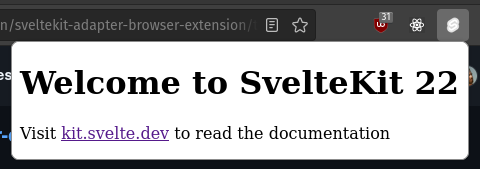

# sveltekit-adapter-browser-extension example

Create a simple popup extension with `sveltekit-adapter-browser-extension`.



## Creating a project

If you're seeing this, you've probably already done this step. Congrats!

```bash
# create a new project in the current directory
npm init svelte@next

# create a new project in my-app
npm init svelte@next my-app
```

> Note: the `@next` is temporary

## Developing/building

Once you've created a project and installed dependencies with `npm install` (or `pnpm install` or `yarn`), build the extension:

```bash
npm run build
```

Your extension should now be in the `build` folder of your project. You can then manually install it in [Chrome](https://support.google.com/chrome/a/answer/2714278?hl=en) or [Firefox](https://developer.mozilla.org/en-US/docs/Mozilla/Add-ons/WebExtensions/Your_first_WebExtension#installing). Note that Firefox requires you to set `manifestVersion: 2` in `svelte.config.js`.
